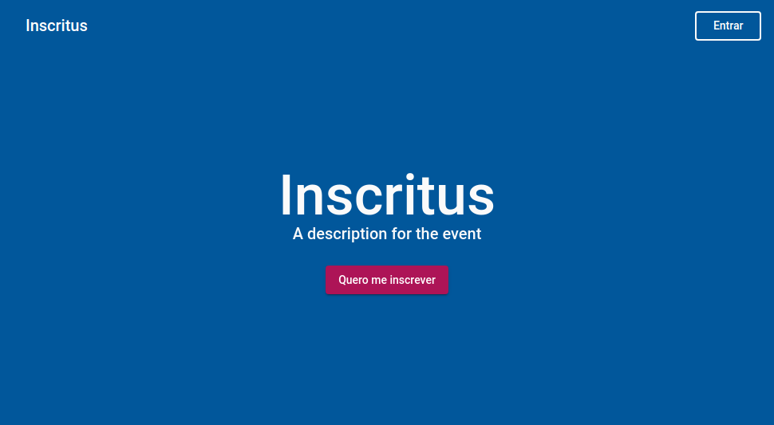

# InscritusWeb

<p></p>

1. [Introdução](#introdução)
1. [Funcionalidades](#funcionalidades)
    1. [Visão do participante](#visão-do-participante)
    1. [Visão do administrador](#visão-do-administrador)
1. [Observações gerais sobre o projeto](#observações-gerais-sobre-o-projeto)
    1. [Infraestrutura](#infraestrutura)
    1. [Configurações gerais](#configurações-gerais)
    1. [Estrutura do Banco de Dados](#estrutura-do-banco-de-dados)
1. [Informações sobre o Front-End](#informações-sobre-o-front-end)
    1. [Instalação](#instalação)
    1. [Execução e Compilação](#execução-e-compilação)
    1. [Deploy](#deploy)
    1. [Estrutura de pastas](#estrutura-de-pastas)
    1. [Configurações do projeto](#configurações-do-projeto)
1. [Informações sobre o Back-End](#informações-sobre-o-back-end)
    1. [Instalação](#instalação-1)
    1. [Execução e Compilação](#execução-e-compilação-1)
    1. [Deploy](#deploy-1)
    1. [Estrutura de pastas](#estrutura-de-pastas-1)
    1. [Configurações do projeto](#configurações-do-projeto-1)


## Introdução

Inscritus Web é um sistema *white label* *open-source* para gerenciamento de evento. O projeto foi desenvolvido na disciplina **MC853 - Projeto em Sistemas de Programação**, oferecida pelo Instituto de Computação da Universidade Estadual de Campinas (IC/UNICAMP) no primeiro semestre letivo de 2020 (1S2020).

Este projeto também possui um app mobile que pode ser usado concomitantemente com o sistema web, podendo não fornecer todas as funcionalidades que o sistema web possui, porém entregando também novas funcionalidades. Para saber mais, acesse o [repositório do app mobile](https://github.com/caiopardal/mc853_mobile).

Para acessar um *live demo*, clique aqui.
* Admin: `admin@teste.com` / `123456`
* Participante: `user@teste.com` / `123456`

## Funcionalidades

O sistema é estruturado de forma que uma instância do sistema gerencia um único evento, o qual pode conter diversas atividades vinculadas. Dentre as funcionalidades implementadas temos:

### Visão do participante:

* Cadastro no evento
* Confirmação de e-mail
* Redefinição de senha
* Alteração de dados cadastrais e senha
* Identificação por QR Code para registro de presença
* Visualização de avisos gerais
* Visualização dos palestrantes do evento
* Visualização das atividades do evento
* Possibilidade de favoritar atividades
* Possibilidade de se inscrever em atividades
* Visualização das presenças em atividades

### Visão do administrador:

Todas as funcionalidades de usuário, além de:
* Gerenciamento de usuários:
  * Visualização
  * Edição
  * Bloqueio de acesso
* Gerenciamento de atividades
  * Criação
  * Visualização
  * Edição
  * Controle de disponibilidade para visualização pelo usuário
* Gerenciamento de palestrantes
  * Criação
  * Visualização
  * Edição
  * Remoção
* Gerenciamento de avisos
  * Criação
  * Visualização
  * Edição
  * Remoção
* Gerenciamento de locais
  * Criação
  * Visualização
  * Edição
  * Remoção
* Gerenciamento de tipos de atividade
  * Criação
  * Visualização
  * Edição
  * Remoção
* Gerenciamento de presenças em atividades
  * Registro
  * Remoção
  * Visualização
* Gerenciamento de inscrições em atividades
  * Registro
  * Remoção
  * Visualização
  * Definição de limite de vagas
  * Definição de momento da abertura das inscrições 

## Observações gerais sobre o projeto

Este projeto utiliza duas versões do `node.js` (v10 para o back-end e v12 para o front-end). Desta forma, recomenda-se a utilização do software `nvm` para fácil gerênciamento e troca entre as versões.

* [node.js](https://nodejs.org/)
* [nvm](https://github.com/nvm-sh/nvm)

Todos os comandos apresentados neste README são compatíveis com `npm` e `yarn` como gerenciadores de dependências. Nós recomendamos a utilização do `yarn` e, por esta razão, todos os comandos serão apresentados no formato deste gerenciador. Caso prefira utilizar o `npm`, basta utilizar a sintaxe exigida pelo mesmo.

* [yarn (Recomendado)](https://yarnpkg.com/)
* [npm](https://www.npmjs.com/)

### Infraestrutura

Este projeto utiliza o Firebase como plataforma de *cloud computing* para hospedar esta aplicação como um todo, incluindo seus 5 principais produtos: autenticação, banco de dados, armazenamento de arquivos, hospedagem e microsserviços. A escolha dessa plataforma se deu devido à sua fácil integração com as demais tecnologias utilizadas, à sua fácil curva de aprendizagem e seu baixo custo comparado aos demais serviços concorrentes.

* [Firebase](https://firebase.google.com/)

### Configurações gerais

Para criar um novo projeto no Firebase, consulte a [documentação oficial](https://firebase.google.com/docs/projects/learn-more?hl=pt-br).

Para criar o primeiro administrador dentro do sistema, realize os seguintes passos:

1. Cadastre-se normalmente no sistema
1. No banco de dados, encontre o registro do usuário desejado na *collection* `users` e acrescente uma propriedade do tipo `boolean` chamada `isAdmin` com valor `true`. Após isso você poderá definir outros administradores pelo próprio sistema.

### Estrutura do Banco de Dados

O banco de dados do sistema possui a seguinte estrutura:

| Collection | Model |
| --------------- | ----- |
|users|`/functions/src/users/user.model.ts --> User`|
|activities|`/functions/src/activities/activity.model.ts --> Activity`|
|speakers|`/functions/src/speakers/speaker.model.ts --> Speaker`|
|activity-types|`/functions/src/activities/activity.model.ts --> ActivityType`|
|locations|`/functions/src/locations/location.model.ts --> Location`|
|feed|`/functions/src/feed/feed.model.ts --> Post`|

Além disso, há também algumas *subcollections* para controle das atividades:

| Collection | SubCcollection | Model |
| ---------------- | ------------- | ------ |
|users|attendances|`/functions/src/users/user.model.ts --> UserAttendance`|
|users|favorites|`/functions/src/users/user.model.ts --> FavoriteActivity`|
|users|registrations|`/functions/src/users/user.model.ts --> UserRegistration`|
|activities|attendants|`/functions/src/activities/activity.model.ts --> ActivityAttendance`|
|activities|registrations|`/functions/src/activities/activity.model.ts --> ActivityRegistration`|

**ATENÇÃO:** Nenhuma das collections acima precisarão ser criadas previamente. As mesmas serão criadas automaticamente conforma a utilização do sistema.

## Informações sobre o Front-End

O front-end do projeto foi construído utilizando o framework Angular 9, utilizando padrões de design do Material UI através da biblioteca Angular Material. Devido ao uso do Firebase como plataforma de *cloud computing* a necessidade de uma estrutura de back-end diminui drasticamente, uma vez que o mesmo pemite comunicação direta do front-end com o banco de dados e o serviço de gerenciamento de autenticação.

### Instalação

Para instalar as dependências do front-end, basta executar o seguinte comando na **raiz do projeto**:

```
yarn
```

### Execução e Compilação

Para servir o código do front-end localmente, basta executar o seguinte comando:

```
yarn start
```

Para compilar o código do front-end em modo de **desenvolvimento**, execute:

```
yarn build
```

Para compilar o código do front-end em modo de **produção**, execute:

```
yarn build:prod
```

O código compilado, em ambos os modos, estará disponível na pasta `/public/inscritus-web`, dentro do projeto.

### Deploy

Para lançar o front-end da aplicação usando o Firebase é necessário ter o firebase-cli instalado e configurado (saiba mais na [documentação oficial](https://firebase.google.com/docs/cli?hl=pt-br)). Para efetuar o lançamento, execute:

```
firebase use <nome-do-projeto-no-firebase>
yarn deploy
```

Após o término da execução, a nova versão já estará disponível para uso.

**IMPORTANTE:** O código lançado é aquele que estiver disponível na pasta `/public/inscritus-web`, dentro do projeto, no momento da execução dos comandos acima. Certifique-se de compilar o código adequadamente antes de realuzar o lançamento.

### Estrutura de pastas

A estrutura dos arquivos do front-end se dá da seguinte forma:
```
/
  |-/public --> Arquivos compilados
  |-/node_modules --> Dependências
  |-/src 
    |-/app --> Código da aplicação
      |-/auth --> Gerenciamento de autenticação
      |-/common --> Diretivas, pipes e códigos de uso geral
      |-/components --> Elementos de tela reutilizáveis
      |-/containers --> Páginas do sistema
        |-/admin-side --> Páginas presentes apenas na visualização de administrador
        |-/user-side --> Páginas presentes apenas na visualização de participante
        |-/... --> Páginas comuns a ambas as visulizações
      |-/services --> Serviços do sistema 
      |-/templates --> Estruturas de página globais
    |-/assets --> Imagens
    |-/config --> Configurações gerais
    |-/environments --> Configurações de ambiente e compilação
    |-favicon.ico --> Ícone da aplicação 
    |-styles.scss --> Estilos gerais da aplicação 
    |-theme.scss --> Configurações do tema da aplicação 
    |-variables.scss --> Variáveis de estilos 
    index.html --> Arquivo raiz, onde a página será carregada
```

### Configurações do projeto

As configurações necessárias para o back-end são:

1. Altere o arquivo `/src/favicon.ico` para o de sua preferência
1. Altere as informações sobre a sua aplicação no arquivo `/src/config/app-info.ts`, incluindo nome, versão, descrição e links para Termos de Uso e Política de Privacidade, podendo ambos serem rotas do sistema ou links externos.
1. Altere as cores do sistema no arquivo `/src/theme.scss` para as de sua preferência. Recomenda-se a utilização das [paletas de cores do Material UI](https://material.io/design/color/the-color-system.html#tools-for-picking-colors)
1. Obtenha o [objeto de configuração do Firebase](https://firebase.google.com/docs/web/setup?hl=pt-br#config-object) e adicione-o nos arquivos `/src/environments/environment.ts` e `/src/environments/environment.prod.ts`. Além disso, altere os valores de `functionsUrl` em ambos os arquivos para coreesponderem aos endereços onde o seu back-end será servido em cada um dos ambientes.


## Informações sobre o Back-End

Todas as operações envolvendo o back-end devem ser executadas utilizando o `node.js` versão 10, que é a versão suportada pelo Firebase Functions. 

Para instalar o `node v10` usando o `nvm` execute:

```
nvm install 10
```

Para utilizar o `node v10` usando o `nvm` execute:

```
nvm use 10
```

### Instalação

Para instalar as dependências do back-end, basta executar o seguinte comando na **pasta `functions`**:

```
yarn
```

### Execução e Compilação

Para servir o código localmente, basta executar o seguinte comando:

```
firebase use <nome-do-projeto>
yarn serve
```

Para compilar o código, execute:

```
firebase use <nome-do-projeto>
yarn build
```
O código compilado estará disponível na pasta `/functions/lib`, dentro do projeto.

### Deploy

Para lançar o back-end da aplicação usando o Firebase é necessário ter o firebase-cli instalado e configurado (saiba mais na [documentação oficial](https://firebase.google.com/docs/cli?hl=pt-br)). Para efetuar o lançamento, execute:

```
firebase use <nome-do-projeto-no-firebase>
yarn deploy
```

### Estrutura de pastas

A estrutura dos arquivos do back-end se dá da seguinte forma:
```
/functions
  |-/lib --> Arquivos compilados
  |-/node_modules --> Dependências
  |-/src --> Código: models, APIs e Handlers
    |-/activities
    |-/feed
    |-/locations
    |-/speakers
    |-/users
    index.ts --> Visibilidade de APIs e configurações
  |-<your-key-file>.json
```

### Configurações do projeto

As configurações necessárias para o back-end são:

1. Gere uma nova privada para o SDK Admin do Firebase. Para saber mais, acesse a [documentação oficial sobre este tópico](https://firebase.google.com/docs/admin/setup?hl=pt-br).
1. Coloque o arquivo de chave com extensão `.json` na pasta `functions`, conforme mostrado acima.
1. Altere o nome do arquivo de chave e o valor do `databaseURL` no arquivo `/functions/src/index.ts`, conforme especificado abaixo:

```
const serviceAccount = require("../<key_filename>.json");

admin.initializeApp({
  credential: admin.credential.cert(serviceAccount),
  databaseURL: "your_database_url"
});
```

